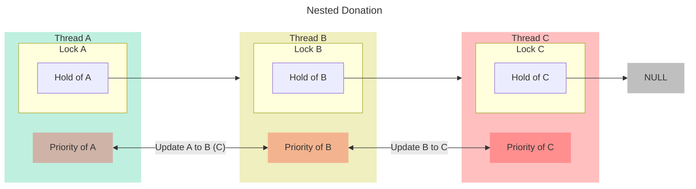
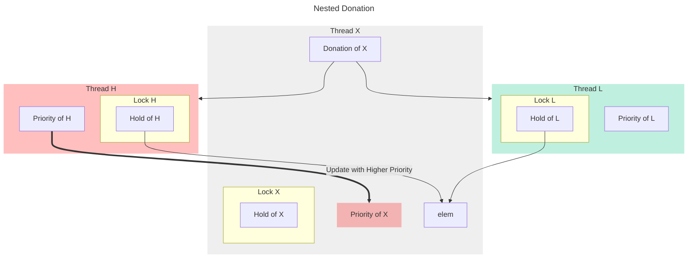

# Project 1 Design Report

## Analysis of the current implementation

### Thread System

```c
struct thread
{
  /* Owned by thread.c. */
  tid_t tid;                 /* Thread identifier. */
  enum thread_status status; /* Thread state. */
  char name[16];             /* Name (for debugging purposes). */
  uint8_t *stack;            /* Saved stack pointer. */
  int priority;              /* Priority. */
  struct list_elem allelem;  /* List element for all threads list. */

  /* Shared between thread.c and synch.c. */
  struct list_elem elem; /* List element. */

#ifdef USERPROG
  /* Owned by userprog/process.c. */
  uint32_t *pagedir; /* Page directory. */
#endif

  /* Owned by thread.c. */
  unsigned magic; /* Detects stack overflow. */
};
```

핀토스의 스레드는 `thread.h` 파일에 정의된 `thread` 구조체로 관리된다. `thread` 구조체는 thread id(`tid`), 상태(`status`), 스택 포인터(`stack`), 우선 순위(`priority`)를 저장한다.

구조체의 가장 마지막에 있는 `magic` 필드는 스택 오버플로우를 감지하는 데에 사용된다. 핀토스에서 스레드는 palloc 메모리 할당기에 의해 한 페이지 (4096바이트)를 할당받고, `tid`, `status` 등의 `thread` 구조체 필드들은 0바이트부터 저장되고, 스택의 데이터는 4KB부터 0바이트를 향해 쌓이기 때문에 스택에 너무 많은 데이터가 저장된다면 스레드의 데이터를 덮어쓸 위험이 있다. 만약 스택에 과도하게 데이터가 쌓인다면 구조체의 `magic` 필드가 가장 먼저 덮어 씌어질 것이고, 핀토스는 이 `magic` 필드가 지정된 값 (`THREAD_MAGIC`)값과 달라질 때 스택 오버플로우가 발생한 것으로 판정하고 커널 패닉을 일으킨다.

핀토스 스레드의 상태는 `thread_status` enum의 네 가지 중 하나의 값으로 결정된다.

```c
enum thread_status
{
  THREAD_RUNNING, /* Running thread. */
  THREAD_READY,   /* Not running but ready to run. */
  THREAD_BLOCKED, /* Waiting for an event to trigger. */
  THREAD_DYING    /* About to be destroyed. */
};
```

핀토스 스레드의 우선 순위는 0 (`PRI_MIN`) 이상 63 (`PRI_MAX`) 이하의 정수 값이고, 기본 우선 순위는 31 (`PRI_DEFAULT`) 이다.

`THREAD_RUNNING`, `THREAD_READY`, `THREAD_BLOCKED`, `THREAD_DYING` 각각의 의미는 다음과 같다.

- `THREAD_RUNNING`: 스레드가 현재 실행 중
- `THREAD_READY`: 스레드가 실행 중은 아니지만 언제든지 실행될 수 있는 상태
- `THREAD_BLOCKED`: 스레드가 특정 조건을 만족할 때까지 기다리는 상태
- `THREAD_DYING`: 곧 삭제될 상태

핀토스의 스레드 시스템에서는 모든 스레드를 모아 놓은 리스트인 `all_list`와 THREAD_READY 상태인 스레드를 모아 놓은 `ready_list` 두 개의 리스트를 관리하면서 스레드를 추가, 삭제하고 스케줄링한다. 이때 `all_list`와 `ready_list`는 일종의 critical section이므로 synchronization이 필요하다. 하지만 이들 리스트는 인터럽트 핸들러에 의해 실행하는 `thread_yield`, `schedule` 등의 함수에서 수정되는 경우가 얼마든지 가능하다. 인터럽트 핸들러에서는 스레드의 sleep이 불가능하므로, lock과 같은 synchronization primitive를 사용할 수는 없다. 이련 이유로 핀토스에서는 `all_list`와 `ready_list`를 동기화하기 위해 이들 리스트를 변경하기 전에 인터럽트를 비활성화하고, 변경이 끝난 후에는 인터럽트를 활성화한다.

#### Thread-Related Functions

##### `thread_init`

```c
void
thread_init (void)
{
  ASSERT (intr_get_level () == INTR_OFF);

  lock_init (&tid_lock);
  list_init (&ready_list);
  list_init (&all_list);

  /* Set up a thread structure for the running thread. */
  initial_thread = running_thread ();
  init_thread (initial_thread, "main", PRI_DEFAULT);
  initial_thread->status = THREAD_RUNNING;
  initial_thread->tid = allocate_tid ();
}
```

thread id 할당을 위한 `tid_lock`, ready list와 전체 스레드 리스트를 초기화한 다음, 메인 스레드를 생성한다.

##### `thread_start`

```c
void
thread_start (void)
{
  /* Create the idle thread. */
  struct semaphore idle_started;
  sema_init (&idle_started, 0);
  thread_create ("idle", PRI_MIN, idle, &idle_started);

  /* Start preemptive thread scheduling. */
  intr_enable ();

  /* Wait for the idle thread to initialize idle_thread. */
  sema_down (&idle_started);
}
```

idle thread를 생성하고, 인터럽트를 활성화한다. Idle thread가 생성됨을 확인한 다음 함수를 종료하기 위해 `idle_started` 세마포어를 사용한다.

##### `thread_tick`

```c
void
thread_tick (void)
{
  struct thread *t = thread_current ();

  /* Update statistics. */
  if (t == idle_thread)
    idle_ticks++;
#ifdef USERPROG
  else if (t->pagedir != NULL)
    user_ticks++;
#endif
  else
    kernel_ticks++;

  /* Enforce preemption. */
  if (++thread_ticks >= TIME_SLICE)
    intr_yield_on_return ();
}
```

타이머 인터럽트에 의해 실행되는 함수이다. 현재 실행 중인 스레드가 idle thread인지, 아닌지에 따라 구분하여 `idle_ticks` 혹은 `kernel_ticks` 변수를 증가시킨다. 또한 `thread_ticks`를 증가시킨 뒤 `TIME_SLICE` 이상 지났는지 확인하여 일정 주기마다 `thread_yield`를 실행되도록 만든다. 이때 `thread_yield` 대신 `intr_yield_on_return`을 사용하는 이유는 `thread_tick` 함수가 타이머 인터럽트에 의해 실행되는 함수이기 때문이다. 인터럽트 도중에 스레드를 sleep 시킬 수 없기 때문에, 인터럽트의 처리가 끝난 후에 `thread_yield`가 실행되도록 한다.

##### `thread_create`

```c
tid_t
thread_create (const char *name, int priority,
               thread_func *function, void *aux)
{
  struct thread *t;
  struct kernel_thread_frame *kf;
  struct switch_entry_frame *ef;
  struct switch_threads_frame *sf;
  tid_t tid;

  ASSERT (function != NULL);

  /* Allocate thread. */
  t = palloc_get_page (PAL_ZERO);
  if (t == NULL)
    return TID_ERROR;

  /* Initialize thread. */
  init_thread (t, name, priority);
  tid = t->tid = allocate_tid ();

  /* Stack frame for kernel_thread(). */
  kf = alloc_frame (t, sizeof *kf);
  kf->eip = NULL;
  kf->function = function;
  kf->aux = aux;

  /* Stack frame for switch_entry(). */
  ef = alloc_frame (t, sizeof *ef);
  ef->eip = (void (*) (void))kernel_thread;

  /* Stack frame for switch_threads(). */
  sf = alloc_frame (t, sizeof *sf);
  sf->eip = switch_entry;
  sf->ebp = 0;

  /* Add to run queue. */
  thread_unblock (t);

  return tid;
}
```

주어진 함수 `function`에 인자 `aux`를 주어 실행하는 스레드를 생성하고, 실행 가능한 상태가 되도록 `thread` 구조체의 각종 필드를 초기화한다. `thread_unblock` 함수를 사용하여 ready list에 생성된 스레드를 넣은 다음 생성된 스레드의 thread id를 반환한다.

##### `thread_block`

```c
void
thread_block (void)
{
  ASSERT (!intr_context ());
  ASSERT (intr_get_level () == INTR_OFF);

  thread_current ()->status = THREAD_BLOCKED;
  schedule ();
}
```

현재 스레드의 상태를 `THREAD_BLOCKED`로 설정하고, `schedule` 함수를 실행한다. 인터럽트 처리 도중에 스레드를 block시킬 경우 OS 자체를 멈추는 결과를 일으킬 수 있기 때문에, `ASSERT`를 통해 인터럽트 처리 중 이 함수가 실행될 경우 커널 패닉이 일어나게 한다.

##### `thread_unblock`

```c
void
thread_unblock (struct thread *t)
{
  enum intr_level old_level;

  ASSERT (is_thread (t));

  old_level = intr_disable ();
  ASSERT (t->status == THREAD_BLOCKED);
  list_push_back (&ready_list, &t->elem);
  t->status = THREAD_READY;
  intr_set_level (old_level);
}
```

현재 스레드의 상태를 `THREAD_READY`로 설정하고, `ready_list`에 추가한다. 앞서 설명했듯, `ready_list`를 변경하는 도중 인터럽트가 발생하지 않도록 인터럽트를 비활성화했다가 다시 활성화하는 것을 볼 수 있다.

##### `thread_exit`

```c
void
thread_exit (void)
{
  ASSERT (!intr_context ());

#ifdef USERPROG
  process_exit ();
#endif

  /* Remove thread from all threads list, set our status to dying,
     and schedule another process.  That process will destroy us
     when it calls thread_schedule_tail(). */
  intr_disable ();
  list_remove (&thread_current ()->allelem);
  thread_current ()->status = THREAD_DYING;
  schedule ();
  NOT_REACHED ();
}
```

현재 스레드를 `all_list`에서 제거하고, 상태를 `THREAD_DYING`으로 설정한 다음 `schedule` 함수를 실행한다. 앞서 설명했듯, `all_list`를 변경하는 도중 인터럽트가 발생하지 않도록 인터럽트를 비활성화했다가 다시 활성화하는 것을 볼 수 있다. 인터럽트 처리 도중 스레드를 종료시킬 경우 OS 자체를 멈추는 결과를 일으킬 수 있기 때문에 `ASSERT`로 인터럽트 처리 도중 이 함수가 실행될 경우 커널 패닉이 일어나게 한다. 또한, `schedule` 함수가 실행된 이후에는 이후에 설명하듯 `thread_schedule`에 의해 스레드가 삭제되어야 하는데, `schedule` 함수가 실행된 이후에도 스레드에서 코드가 실행된다는 것은 핀토스 어딘가에 버그가 존재한다는 뜻이다. 따라서 이 경우에도 커널 패닉이 일어나도록 `NOT_REACHED`를 사용한다.

##### `thread_yield`

```c
void
thread_yield (void)
{
  struct thread *cur = thread_current ();
  enum intr_level old_level;

  ASSERT (!intr_context ());

  old_level = intr_disable ();
  if (cur != idle_thread)
    list_push_back (&ready_list, &cur->elem);
  cur->status = THREAD_READY;
  schedule ();
  intr_set_level (old_level);
}
```

현재 스레드의 상태를 `THREAD_READY`로 설정하고, 현재 스레드가 idle thread가 아닌 경우 `ready_list`에 자신을 추가한 다음 `schedule` 함수를 실행한다. 인터럽트 처리 도중 `thread_yield` 함수가 실행되어 스레드가 멈출 경우 OS를 멈추는 결과를 일으킬 수 있기 때문에, `ASSERT`를 통해 인터럽트 처리 중 이 함수가 실행될 경우 커널 패닉이 일어나게 한다. 또한, 앞서 설명했듯 `ready_list`를 변경하는 도중 인터럽트가 발생하지 않도록 인터럽트를 비활성화했다가 다시 활성화하는 것을 볼 수 있다.

##### `thread_schedule_tail`

```c
void
thread_schedule_tail (struct thread *prev)
{
  struct thread *cur = running_thread ();

  ASSERT (intr_get_level () == INTR_OFF);

  /* Mark us as running. */
  cur->status = THREAD_RUNNING;

  /* Start new time slice. */
  thread_ticks = 0;

#ifdef USERPROG
  /* Activate the new address space. */
  process_activate ();
#endif

  /* If the thread we switched from is dying, destroy its struct
     thread.  This must happen late so that thread_exit() doesn't
     pull out the rug under itself.  (We don't free
     initial_thread because its memory was not obtained via
     palloc().) */
  if (prev != NULL && prev->status == THREAD_DYING && prev != initial_thread)
    {
      ASSERT (prev != cur);
      palloc_free_page (prev);
    }
}
```

현재 스레드의 상태를 `THREAD_RUNNING`으로 바꾸고, `thread_ticks`를 0으로 초기화한다. 이전 스레드가 핀토스가 최초로 실행한 스레드(`initial_thread`)가 아니면서 `THREAD_DYING` 상태일 경우 이전 스레드를 정리한다.

##### `switch_threads`

```assembly
.globl switch_threads
.func switch_threads
switch_threads:
	# Save caller's register state.
	#
	# Note that the SVR4 ABI allows us to destroy %eax, %ecx, %edx,
	# but requires us to preserve %ebx, %ebp, %esi, %edi.  See
	# [SysV-ABI-386] pages 3-11 and 3-12 for details.
	#
	# This stack frame must match the one set up by thread_create()
	# in size.
	pushl %ebx
	pushl %ebp
	pushl %esi
	pushl %edi

	# Get offsetof (struct thread, stack).
.globl thread_stack_ofs
	mov thread_stack_ofs, %edx

	# Save current stack pointer to old thread's stack, if any.
	movl SWITCH_CUR(%esp), %eax
	movl %esp, (%eax,%edx,1)

	# Restore stack pointer from new thread's stack.
	movl SWITCH_NEXT(%esp), %ecx
	movl (%ecx,%edx,1), %esp

	# Restore caller's register state.
	popl %edi
	popl %esi
	popl %ebp
	popl %ebx
        ret
.endfunc

.globl switch_entry
.func switch_entry
switch_entry:
	# Discard switch_threads() arguments.
	addl $8, %esp

	# Call thread_schedule_tail(prev).
	pushl %eax
.globl thread_schedule_tail
	call thread_schedule_tail
	addl $4, %esp

	# Start thread proper.
	ret
.endfunc
```

어셈블리어로 작성된 함수로, 편의상 첫 번째로 주어진 인자를 `cur`, 두 번째로 주어진 인자를 `next`라고 하자. 스택에 현재 실행 중인 스레드 `cur`의 레지스터와 스택 포인터를 저장하고, 다음에 실행될 스레드 `next`의 스택에서 스택 포인터, 레지스터 값을 복구해 온다. `switch_threads` 함수는 핀토스에서 스레드 사이를 오갈 수 있는 유일한 통로 역할을 한다.

##### `schedule`

```c
static void
schedule (void)
{
  struct thread *cur = running_thread ();
  struct thread *next = next_thread_to_run ();
  struct thread *prev = NULL;

  ASSERT (intr_get_level () == INTR_OFF);
  ASSERT (cur->status != THREAD_RUNNING);
  ASSERT (is_thread (next));

  if (cur != next)
    prev = switch_threads (cur, next);
  thread_schedule_tail (prev);
}
```

현재 스레드의 상태가 `THREAD_RUNNING`에서 다른 것으로 바뀌었을 때, 다른 스레드가 실행될 수 있도록 스케줄링을 수행한다. `schedule` 함수는 `switch_threads` 함수를 실행하여 현재 (상태가 `THREAD_RUNNING`이 아니게 된) 스레드 `cur`에서 다음에 실행될 스레드 `next`로 전환한다. 이후 control flow는 `next` 스레드로 넘어가는데, 앞서 설명했듯 스레드 사이를 오갈 수 있는 유일한 통로는 `switch_threads` 함수이고, 이 함수를 호출하는 부분은 `schedule` 함수뿐이기 때문에 `next` 스레드의 실행은 `prev = switch_threads (cur, next)`에서 이어지게 된다. 여기서 `next` 스레드는 이전에 실행되고 있던 `cur` 스레드를 반환받고, `cur` 스레드에 대해 `thread_schedule_tail` 함수를 실행해 스레드 전환을 마무리한다.

### Synchronization Primitives

핀토스에는 `synch.c`에 `semaphore`, `lock`, `condition` 세 가지 synchronization primitive가 구현되어 있다.

#### Semaphore

세마포어는 critical section을 보호하기 위해 자원에 접근할 수 있는 스레드를 제한하는 데에 사용한다. 핀토스는 세마포어를 다음과 같은 구조체로 관리한다.

```c
struct semaphore
{
  unsigned value;      /* Current value. */
  struct list waiters; /* List of waiting threads. */
};
```

`value`는 세마포어가 현재 가지는 값, `waiters`는 세마포어의 값이 0보다 커지길 기다리는 스레드의 리스트이다.

##### `sema_init`

```c
void
sema_init (struct semaphore *sema, unsigned value)
{
  ASSERT (sema != NULL);

  sema->value = value;
  list_init (&sema->waiters);
}
```

새로운 세마포어를 초기화한다. `value`를 지정된 값으로 세팅하고 `waiters` 리스트를 초기화하는 것을 볼 수 있다.

##### `sema_down`

```c
void
sema_down (struct semaphore *sema)
{
  enum intr_level old_level;

  ASSERT (sema != NULL);
  ASSERT (!intr_context ());

  old_level = intr_disable ();
  while (sema->value == 0)
    {
      list_push_back (&sema->waiters, &thread_current ()->elem);
      thread_block ();
    }
  sema->value--;
  intr_set_level (old_level);
}
```

세마포어의 `value`를 down 시킨다. `value`가 0인 경우에는 0이 아닌 값이 될 때까지 현재 스레드를 block시킨다. `value`가 0이 아닌 값이 되면 반복문을 빠져나와 1 감소시킨다. 앞서 설명했듯 인터럽트를 처리 중인 스레드를 block시킬 수 없기 때문에 `ASSERT`로 인터럽트 핸들러에서 코드가 실행되지 않도록 검사하고, `thread_block`에 의해 `ready_list`와 같은 전역 자료 구조가 변경될 수 있기 때문에 인터럽트를 비활성화하여 synchronization을 수행한다.

##### `sema_try_down`

```c
bool
sema_try_down (struct semaphore *sema)
{
  enum intr_level old_level;
  bool success;

  ASSERT (sema != NULL);

  old_level = intr_disable ();
  if (sema->value > 0)
    {
      sema->value--;
      success = true;
    }
  else
    success = false;
  intr_set_level (old_level);

  return success;
}
```

앞서 설명한 `sema_down`에서 반복문으로 기다리는 대신, 한 번만 down을 시도하는 함수이다. `sema_down`과 달리 인터럽트 핸들러에서도 실행할 수 있다. 단, 인터럽트 핸들러에서 `sema_try_down`을 하는 경우에는 `sema->value`에 접근하는 코드 또한 critical section이 되므로 이에 대한 synchronization을 위해 인터럽트를 `sema->value`를 체크하고 감소시키는 코드 전후에서 비활성화/활성화한다. `value`를 감소시키는 데 성공했다면 `true`, 아니면 `false`를 반환한다.

##### `sema_up`

```c
void
sema_up (struct semaphore *sema)
{
  enum intr_level old_level;

  ASSERT (sema != NULL);

  old_level = intr_disable ();
  if (!list_empty (&sema->waiters))
    thread_unblock (list_entry (list_pop_front (&sema->waiters),
                                struct thread, elem));
  sema->value++;
  intr_set_level (old_level);
}
```

세마포어의 `value`를 up시킨다. 세마포어의 `waiters` 리스트에서 스레드를 하나 꺼내 unblock하고, `value`를 1 증가시킨다. 이 함수도 인터럽트 핸들러 내부에서 실행될 수 있기 때문에, critical section이 되는 `sema->value`를 접근하는 코드에 대한 synchronization을 위해 인터럽트를 비활성화/활성화 하는 것을 볼 수 있다.

#### Lock

락은 critical section에 대한 접근을 통제하는 데 사용하는 synchronization primitive이다. 핀토스는 락을 다음과 같은 구조체로 관리한다.

```c
struct lock
{
  struct thread *holder;      /* Thread holding lock (for debugging). */
  struct semaphore semaphore; /* Binary semaphore controlling access. */
};
```

`holder`는 현재 락을 가지고 있는 스레드, `semaphore`는 락을 구성하는, 0 또는 1을 담는 세마포어이다.

##### `lock_init`

```c
void
lock_init (struct lock *lock)
{
  ASSERT (lock != NULL);

  lock->holder = NULL;
  sema_init (&lock->semaphore, 1);
}
```

락을 초기화한다. 초기 상태에서 락을 소유하고 있는 스레드가 없고, 세마포어에 1을 넣는 것을 볼 수 있다.

##### `lock_acquire`

```c
void
lock_acquire (struct lock *lock)
{
  ASSERT (lock != NULL);
  ASSERT (!intr_context ());
  ASSERT (!lock_held_by_current_thread (lock));

  sema_down (&lock->semaphore);
  lock->holder = thread_current ();
}
```

락을 획득한다. 세마포어에 대해 down을 수행하는데, 만약 락을 다른 스레드가 들고 있다면 세마포어의 `value`가 0이므로 1이 될 때까지 현재 스레드가 block되고, 그렇지 않다면 바로 `value`를 1에서 0으로 감소시키고 락을 획득할 것이다. 세마포어를 감소시킨 후에는 `holder`를 현재 스레드로 바꾸는 것을 볼 수 있다. 이 함수는 `sema_down`을 호출하기 때문에, 인터럽트 핸들러 내부에서는 실행할 수 없으므로 `ASSERT`로 확인하는 것을 볼 수 있다.

##### `lock_try_acquire`

```c
bool
lock_try_acquire (struct lock *lock)
{
  bool success;

  ASSERT (lock != NULL);
  ASSERT (!lock_held_by_current_thread (lock));

  success = sema_try_down (&lock->semaphore);
  if (success)
    lock->holder = thread_current ();
  return success;
}
```

락의 획득을 시도한다. `sema_down` 대신 스레드를 block하지 않는 `sema_try_down`을 사용하고, 성공 여부를 반환한다. `sema_try_down`과 같이 인터럽트 핸들러에서 실행 가능하다.

##### `lock_release`

```c
void
lock_release (struct lock *lock)
{
  ASSERT (lock != NULL);
  ASSERT (lock_held_by_current_thread (lock));

  lock->holder = NULL;
  sema_up (&lock->semaphore);
}
```

현재 스래드가 들고 있는 락을 해제한다. `holder`를 `NULL`으로 설정하고 `sema_up`을 수행하는 것을 볼 수 있다.

##### `lock_held_by_current_thread`

```c
bool
lock_held_by_current_thread (const struct lock *lock)
{
  ASSERT (lock != NULL);

  return lock->holder == thread_current ();
}
```

현재 스레드가 락을 가지고 있는지 검사하는 함수이다.

#### Conditional Variable

Conditional variable은 여러 스레드가 특정 조건이 될 때까지 기다리는 상황에서 사용되는 synchronization primitive이다. 핀토스는 conditional variable을 다음과 같은 구조체로 관리한다.

```c
struct condition
{
  struct list waiters; /* List of waiting threads. */
};
```

`waiters`는 조건이 참이 될 때까지 기다리는 스레드가 `sema_down` 하려는 세마포어의 리스트이다.

##### `cond_init`

```c
void
cond_init (struct condition *cond)
{
  ASSERT (cond != NULL);

  list_init (&cond->waiters);
}
```

`condition` 구조체를 초기화한다. `waiters` 리스트를 초기화하는 것을 볼 수 있다.

##### `cond_wait`

```c
void
cond_wait (struct condition *cond, struct lock *lock)
{
  struct semaphore_elem waiter;

  ASSERT (cond != NULL);
  ASSERT (lock != NULL);
  ASSERT (!intr_context ());
  ASSERT (lock_held_by_current_thread (lock));

  sema_init (&waiter.semaphore, 0);
  list_push_back (&cond->waiters, &waiter.elem);
  lock_release (lock);
  sema_down (&waiter.semaphore);
  lock_acquire (lock);
}
```

조건이 참이 될 때까지 기다리는 스레드를 하나 더 추가한다. 현재 스레드가 가지고 있는 `waiters` 리스트에 `waiter`를 추가하고 `lock`을 해제한 다음, `waiter`의 세마포어를 down 시키고 `lock`을 다시 획득한다. 이 함수의 경우 `lock`을 획득하는 과정이 필요하므로 인터럽트 핸들러에서 실행되는 것을 `ASSERT`로 방지한다.

##### `cond_signal`

```c
void
cond_signal (struct condition *cond, struct lock *lock UNUSED)
{
  ASSERT (cond != NULL);
  ASSERT (lock != NULL);
  ASSERT (!intr_context ());
  ASSERT (lock_held_by_current_thread (lock));

  if (!list_empty (&cond->waiters))
    sema_up (&list_entry (list_pop_front (&cond->waiters),
                          struct semaphore_elem, elem)
                  ->semaphore);
}
```

조건을 기다리는 스레드들이 있을 때, 리스트의 맨 앞에 있는 세마포어를 꺼내 `sema_up`을 수행한다.

##### `cond_broadcast`

```c
void
cond_broadcast (struct condition *cond, struct lock *lock)
{
  ASSERT (cond != NULL);
  ASSERT (lock != NULL);

  while (!list_empty (&cond->waiters))
    cond_signal (cond, lock);
}
```

`waiters`에 있는 모든 세마포어에 대해 `cond_signal`을 실행시킨다.

## Design Plan

### Alarm Clock

#### Structure to be added

##### `struct list sleeping_list`
스레드 Sleeping을 busy waiting 방식의 구현에서 바꾸기 위해 새로운 `list`인 `sleeping_list`를 thread system에 추가한다.

##### `int64_t thread_wakeup_time`
각 스레드가 깨어나야 할 시간을 저장하기 위해 `struct thread`에 `int64_t` 타입의 `thread_wakeup_time`을 추가한다.

#### Functions to be modified

##### `timer_sleep()`

`timer_sleep()`를 다시 구현하기 위해 다음과 같은 방법을 택할 것이다.

1. 해당 함수의 인자로 받은 `tick` 만큼의 시간 이후에 깨어날 수 있도록 현재 스레드의 `thread_wakeup_time`을 설정한다.
2. 현재 스레드의 `elem`을 `sleep_list`에 스레드의 `thread_wakeup_time`이 증가하는 순서로 삽입한다. 이 과정은 $O(n)$의 시간이 소요된다.
3. 삽입한 스레드의 `status`를 `THREAD_BLOCKED`으로 설정한다.
   - `status`를 설정하는 데 있어서 `thread_block()` 함수를 사용할 수 있다. 이 때, 앞서 언급한 OS가 멈추는 결과를 초래하지 않기 위한 `ASSERT (intr_get_level () == INTR_OFF);` 구문을 만족시키기 위해 `thread_block()`의 실행 전과 후에 interrupt level을 변경하는 부분이 필요하다.

개략적인 Pseudocode는 다음과 같다.

```c
void
timer_sleep (int64_t ticks) 
{  
  "[Set the interrupt level to INTR_OFF]"
  
  /* Set current thread status wakeup time*/
  thread_current()->thread_wakeup_time = "[Now OS tick]" + ticks;

  /* Insert current thread to sleep_list, by increasing order of thread_wakeup_time*/
  list_insert_ordered ( 
    &sleep_list,              // List to store sleeping threads
    &thread_current()->elem,  // Store-able element of thread
    "[Function ptr. to compare thread_wakeup_time]",
    NULL  // No arguments are passed
  );

  thread_block ();  //Set current thread state to THREAD_BLOCK
  
  "[Restore the previous interrupt level]"

  return;
}
```

##### `timer_interrupt()`

`timer_sleep()`에서 스레드의 `status`가 `THREAD_BLOCKED`로 전환된 스레드를 시간에 맞추어 `THREAD_READY` 상태의 `status`로 복원하기 위해 다음 방법을 택할 것이다.

1. `thread_tick()`이 호출 된 이후 `sleeping_list`를 순회하며 스레드의 `thread_wakeup_time`이 현재 시간이 된 스레드의 `status`를 `THREAD_READY`로 설정한다.
   - `sleeping_list`를 순회할 때 순서에 맞게 삽입했기 때문에 $O(1)$의 시간에 스레드를 unblock할 수 있다.

개략적인 Pseudocode는 다음과 같다.

```c
static void
timer_interrupt (struct intr_frame *args UNUSED)
{
  "[Increase the OS ticks and thread ticks]"

  for("[sleep_list is Non-empty and front of the sleep_list should be woke up]")
  {
    list_pop_front(&sleep_list);
    "[Unblock the popped thread]"
  }

  return;
}
```

### Priority Scheduler

#### Abstract sequence of Nested Donation

기본적으로 CPU를 사용하지 않는 스레드는 `thread->status`가 `THREAD_READY` 상태이며, 이들은 모두 `ready_list`에 `priority`에 따라 정렬된 상태로 삽입되어야 한다. 기존에 실행되던 스레드가 CPU를 `yield`하고 다시 `ready_list`로 들어오는 경우 다음으로 우선순위가 높은 스레드가 바로 실행되어야 하기 때문에, [Alarm Clock의 구현](#`timer_sleep()`) 에서와 마찬가지로 우선순위에 맞게 $O(n)$의 시간에 스레드를 삽입, $O(1)$의 시간에 스레드를 꺼낼 수 있도록 구현할 것이다.

서로 다른, 다양한 우선순위의 스레드가 같은 `lock`을 가지는 경우가 있을 수 있으며, 이 경우는 다음과 같이 `priority`를 donate받을 수 있다.



이 경우, **재귀적인 과정**을 통해 스레드의 Priority를 반영하는 과정이 필요하다. 다음과 같은 Pseudocode로 나타낼 수 있다.

```c
void
thread_priority_donate()
{
    struct thread* current_thread = thread_current();	// Current thread
    int initial_priority = current_thread->priority;	// Donation with starting priority
    
    while("[Current thread's holder is valid]")
    {
        "[Move current thread to current thread's holder]";
        "[Update current thread's priority with `initial_priority`]";
    }
    return;
}
```


#### Abstract sequence of Multiple Donation

여러 개의 스레드가 하나의 스레드를 hold하고 있을 경우, 가장 우선순위가 높은 스레드의 우선순위를 공통되는 스레드에게 넘겨 주어야 한다. 이 때, 여러 스레드들은 공통된 스레드의  `struct list donor`에 자신의 `elem`을 삽입하며, 이 때도  [Alarm Clock의 구현](#`timer_sleep()`) 에서와 마찬가지로 우선순위에 맞게 $O(n)$의 시간에 스레드를 삽입, $O(1)$의 시간에 스레드의 정보를 꺼낼 수 있도록 구현할 것이다.



이 경우, 스레드의 `struct list donor`의 맨 앞 값과 비교하여 가장 높은 우선순위 값을 새로운 우선순위로 반영해 주어야 한다. 다음과 같은 Pseudocode로 나타낼 수 있다.

```c
void
thread_priority_update()
{
    struct thread* current_thread = thread_current();	// Current thread
    if ("[Donor list is not empty] && [Thread of (front of donor list) has higher priority than current thread]")
    {
        current_thread->priority = "[Priority of thread of (front of donor list)]";
    }
    return;
}
```


#### Structure to be added to `struct thread`

##### `struct list donor`, `struct list_elem donor_elem`

Multiple donation 상황에서 스레드가 우선순위를 주고받았음을 기록하기 위한 자료구조이다. 언급한 대로, `struct list_elem donor_elem`을 가지고 있는 스레드의 priority 순으로 정렬되어 `struct list donor`에 $O(n)$ 으로 삽입한다. $O(1)$ 에 priority를 갱신하기  위함이다. 

##### `struct lock* wait`

스레드 간 우선순위와 점유 상태를 나타내기 위한 자료구조이다. `struct lock`의 `struct semaphore semaphore`의 `struct list waiters`에서 `thread`의 `elem`을 저장하여 `lock`을 기다리고 있는 스레드들을 나타낼 수 있다.

##### `int priority_init`

다양한 priority donation 과정 이후, 원래의 우선순위로 돌려놓기 위해 초기 우선순위를 기록해놓아야 한다.


### Advanced Scheduler

#### Structure to be added

##### `int mlfqs_nice`

##### `[fixed point type] mlfqs_recent_cpu`

#### Structure to be modified

##### `int priority`

스레드의 `priority`를 donation이 아니라 실시간으로 갱신되는 값으로 사용하기 위해, 앞서 Priority Scheduler에서 사용한 알고리즘과 다른 알고리즘을 통해 값을 설정해야 한다.

#### Function to be added

##### Fixed-point arithmetic

부동소수점 연산은 CPU에게 매우 무거운 연산이기에, 실시간으로 스레드의 Priority를 갱신하기에 적절하지 않다. 따라서 정수형의 비트를 나누어 정수부 및 소수부로 나타내어 표시하는 고정 소수점 연산을 구현해야 하며, Reference documentation에 **17.14 fixed-point number representation**을 사용하도록 명시되어 있다. 

스레드의 priority를 실시간으로 갱신하기 위해 계산에 사용되는 값으로 `1/4`, `1/60`, `59/60`과 같은 (고정 소수점 형태의) 정수 값을 미리 계산하여 상수로 정의, `#define`을 통해 전처리하여 빠른 계산을 도모할 수 있다.

#### Function to be modified